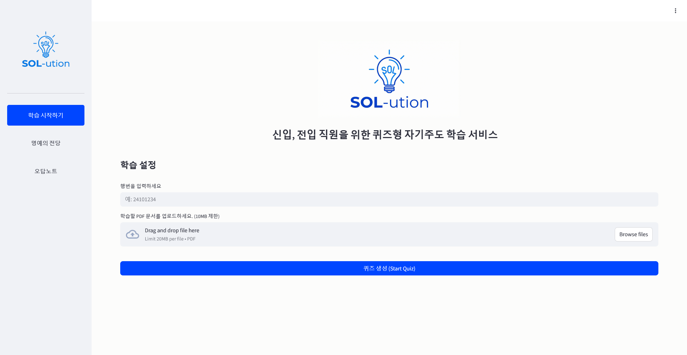
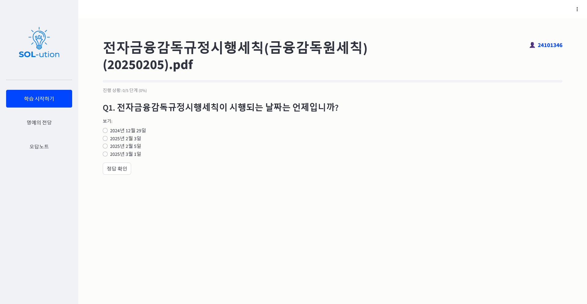

# SOL-ution: Learning Helper 🎓

사내 운영 문서를 퀴즈로 변환하고, 학습 결과를 분석하여 멘토링까지 연계하는 올인원 학습 도우미 웹 애플리케이션입니다.


*(스크린샷 위치: 메인 화면)*

## 🌟 주요 기능

1. **문서 업로드 및 분석**
   - PDF 형식의 사내 운영 문서를 업로드하면 `PyPDF`와 `LangChain`을 통해 텍스트를 자동으로 추출합니다.
2. **AI 기반 퀴즈 생성**
   - Google Gemini AI (`gemini-flash-latest`)를 활용하여 문서 내용에 기반한 5개의 객관식 퀴즈를 즉시 생성합니다.
3. **실시간 풀이 및 피드백**
   - 사용자가 문제를 풀면 즉시 정답 여부를 확인하고, AI가 생성한 상세한 해설을 제공합니다.
4. **멘토링 SOS (Discord 연동)**
   - 문제를 틀리거나 추가 설명이 필요한 경우, 질문 내용을 입력하여 사내 Discord 채널로 전송할 수 있습니다.
5. **학습 기록 저장 (Google Sheets)**
   - 퀴즈 점수, 오답 노트, 멘토링 요청 내역이 Google Sheets에 실시간으로 기록됩니다.
6. **명예의 전당 (Hall of Fame)**
   - `Pandas`를 활용하여 사용자별 최고 점수를 집계하고, 문서별 학습 랭킹(Leaderboard)을 제공합니다.
7. **오답 노트 (Wrong Answer Note)**
   - 사용자의 사번(Employee ID)을 기반으로 과거에 틀린 문제들을 검색하여 다시 복습할 수 있습니다.


*(스크린샷 위치: 퀴즈 풀이 화면)*

## 🛠️ 기술 스택 (Tech Stack)

이 프로젝트는 파이썬 기반의 웹 프레임워크와 최신 AI 기술을 활용하여 구축되었습니다.

- **Frontend/App**: [Streamlit](https://streamlit.io/) (v1.34.0+)
- **LLM Engine**: [Google Gemini](https://deepmind.google/technologies/gemini/) (via `langchain-google-genai`)
- **Data Processing**:
  - `Pandas`: 랭킹 데이터 처리 및 분석
  - `PyPDF`: PDF 텍스트 추출
  - `LangChain Community`: 문서 로딩 및 체인 관리
- **Backend Services**:
  - `Google Sheets API` (`gspread`): 데이터베이스 대용 (점수, 오답, 멘토링 로그)
  - `Discord Webhook`: 알림 및 메시지 전송
- **Logging**: Python `logging` (File & Console Rotating Logs)

### 📂 프로젝트 구조 (Project Structure)

```
SOL-ution/
├── app.py                  # 메인 애플리케이션 진입점 (Streamlit UI 및 로직)
├── requirements.txt        # 프로젝트 의존성 목록
├── assets/                 # 이미지 및 정적 리소스 (로고, 파비콘 등)
├── utils/                  # 핵심 기능 모듈
│   ├── gemini_handler.py   # PDF 처리 및 Gemini 퀴즈 생성 로직
│   ├── sheet_handler.py    # Google Sheets 연동 (점수/오답/멘토링 저장)
│   ├── ranking_handler.py  # Pandas 기반 랭킹/명예의 전당 로직
│   ├── discord_sender.py   # Discord Webhook 메시지 전송 로직
│   └── logger.py           # 중앙 집중식 로깅 설정
├── tests/                  # 단위 테스트
└── .streamlit/             # Streamlit 설정 (테마, 색상 등)
```

## 🚀 설치 및 실행 방법 (Installation & Run)

### 1. 사전 준비 (Prerequisites)
- Python 3.9 이상
- Google Cloud Platform 프로젝트 (Google Sheets API 활성화 및 서비스 계정 키 `service_account.json`)
- Google AI Studio API Key (Gemini 사용)
- Discord Webhook URL (선택 사항)

### 2. 저장소 클론 및 패키지 설치
```bash
git clone https://github.com/your-repo/SOL-ution.git
cd SOL-ution

# 가상환경 생성 (권장)
python -m venv venv
source venv/bin/activate  # Windows: venv\Scripts\activate

# 패키지 설치
pip install -r requirements.txt
```

### 3. 환경 변수 설정 (Configuration)
프로젝트 루트 디렉토리에 `.env` 파일을 생성하고 아래 내용을 작성해주세요.

```ini
# .env file

# Google Gemini API Key
GOOGLE_API_KEY=your_google_api_key_here

# Google Sheets 설정
GOOGLE_SHEET_CREDENTIALS=path/to/your/service_account.json
SPREADSHEET_ID=your_spreadsheet_id_here

# Discord Webhook (멘토링 SOS 기능용)
DISCORD_WEBHOOK_URL=your_discord_webhook_url_here
```

> **주의**: `service_account.json` 파일은 보안상 git에 업로드되지 않도록 주의하세요.

### 4. 실행 (Run)
```bash
streamlit run app.py
```
브라우저가 자동으로 열리며 `http://localhost:8501`에서 앱을 확인할 수 있습니다.

## 📝 로그 확인 및 트러블슈팅

시스템 운영 중 발생하는 주요 이벤트와 에러는 로그 파일에 기록됩니다.

1. **로그 파일**: `./app.log` (최대 5MB, 3개 백업 유지)
2. **실시간 확인**:
   ```bash
   tail -f app.log
   ```
3. **주요 로그 메시지**:
   - `[INFO] [gemini_handler.py]`: 퀴즈 생성 성공 여부
   - `[ERROR] [sheet_handler.py]`: 구글 시트 저장 실패 시
   - `[ERROR] [discord_sender.py]`: 디스코드 전송 실패 시

---
Designed for efficient learning and operational excellence. 🚀
